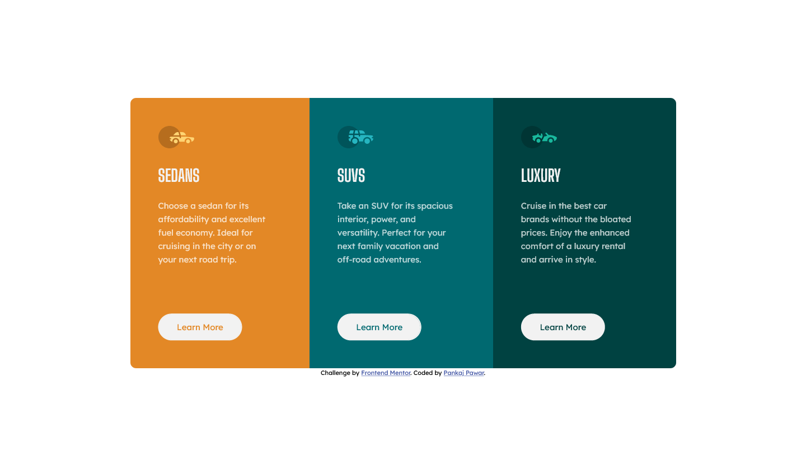
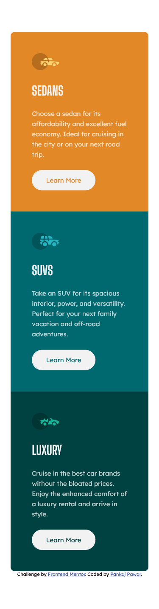

# Frontend Mentor - 3-column preview card component solution

This is a solution to the [3-column preview card component challenge on Frontend Mentor](https://www.frontendmentor.io/challenges/3column-preview-card-component-pH92eAR2-). Frontend Mentor challenges help you improve your coding skills by building realistic projects. 

## Table of contents

- [Overview](#overview)
  - [The challenge](#the-challenge)
  - [Screenshot](#screenshot)
  - [Links](#links)
- [My process](#my-process)
  - [Built with](#built-with)
  - [What I learned](#what-i-learned)
  - [Continued development](#continued-development)
  - [Useful resources](#useful-resources)
- [Author](#author)
- [Acknowledgments](#acknowledgments)

## Overview

### The challenge

Users should be able to:

- View the optimal layout depending on their device's screen size
- See hover states for interactive elements

### Screenshot

### Links

- Solution URL: [Github Repo Link](https://github.com/DamnItAzriel/3-column-preview-card-component)
- Live Site URL: [3 Column Preview Card Component](https://3-column-preview-card-component-chi-two.vercel.app/)

## My process
- HTML
  - link style.css
  - link google font links
  - main
    - Used this first time for frontend challenge (Instead of main div)
    - Added 3 divs for 3 columns
      - each div holds
        - svg car icon
        - h1
        - description para
        - button for learn more
  - footer
    - attribution class for links
- CSS
  -Mobile
    - box-sizing: border-box
    - font family & font-size
    - width:375px
    - margin set 0px auto
    - class h1
      - font-family
      - margin top & bottom
      - text transform
      - color
    - individual classes like sedans, suvs, etc. have same
      - padding
      - color
      - line-height
    - individual classes have different
      - bg-color
      - border radius for mobile
    - button
      - reset default
      - transparent border (so that when you add border for hover, div size wont expand because of border size)
      - cursor- pointer
      - border-radius- 25px
      - bg-color
      - margin
    - different car specific button have different
      - color
    - button:hover
      -bg-color: inherit
      - border
    - class btn:hover
      -color(I tried to add this to above button:hover itself but wasn't working that way)
  - Desktop
    - body: 975px; 3 times width of a mobile as there are 3 columns
    - margin-175px auto
    - main
      - display flex
    - Increased padding right for all 3 car classes
    - Changed border radius for 3 car classes according to design needs
    - button margin-top: 70px

### Built with

- Semantic HTML5 markup
- CSS custom properties
- Flexbox

### What I learned
- I used <main> and <footer> this time around instead of using all divs.
- I tried to use more classes to add more reusability to this code. (I used a lot of divs till this project)
- I learnt to use transparent border to avoid increase of height of div because of hovering over a button.

### Continued development

As of now, I am completely content with this work. Will look to do changes with the report and feeback from the frontend mentor community.

### Useful resources

- [Link Stack overflow answer](https://stackoverflow.com/questions/60391939/div-expand-its-size-on-hover-due-to-border) - When you hover over a button and also try to add border while hovering, it add extra pixels for the border to the design. The site shrinks and expands as you hover. For that in normal state add and transparent border.
- [Remove default style from button](https://stackoverflow.com/questions/2460100/remove-the-complete-styling-of-an-html-button-submit) - Stack overflow thread for removing default styling from button.

## Author

- Website - [Pankaj Pawar](https://www.twitter.com/DamnItAzriel)
- Frontend Mentor - [@DamnItAzriel](https://www.frontendmentor.io/profile/DamnItAzriel)
- Twitter - [@DamnItAzriel](https://www.twitter.com/DamnItAzriel)

## Acknowledgments

I would like to thank frontend mentors for creating this really good challenges which help me hone my front end skills.
